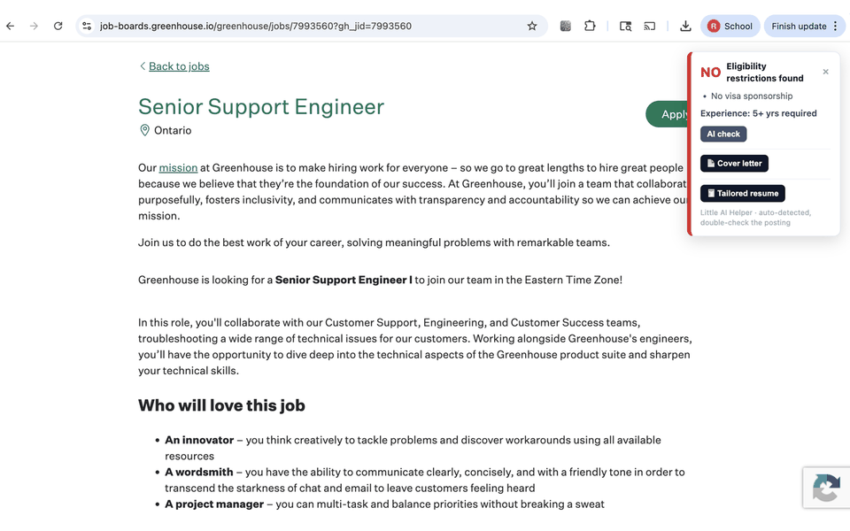
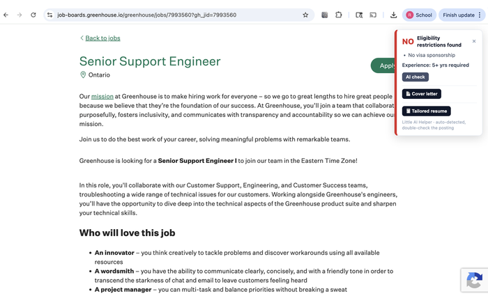
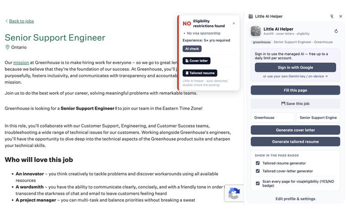
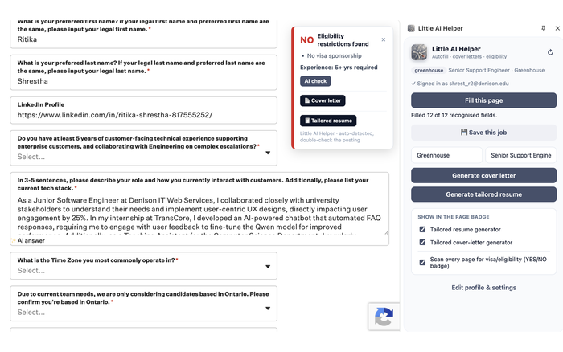
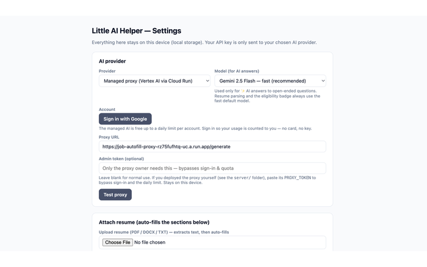

# Little AI Helper (Chrome Extension)

**[Install from the Chrome Web Store](https://chromewebstore.google.com/detail/Little%20AI%20Helper/iibpijacaghdcckphindbaijjgcbaoll)**

## Why I built this

Applying to new-grad SWE roles means filling the *same* Greenhouse / Lever / Workday
forms dozens of times, re-writing the same "why this company?" answers, and manually
checking each posting for visa-sponsorship language before wasting time on a dead end.
Little AI Helper collapses that loop: structured autofill for the boilerplate, an on-page
AI draft for the open-ended questions, and an instant eligibility badge so I never apply
somewhere that won't sponsor.



| Eligibility badge on a live posting | Side panel actions |
| --- | --- |
|  |  |
| **Autofilled fields + ✨ AI answers** | **Configurable AI provider (data stays local)** |
|  |  |

Auto-fills repetitive job applications on **Greenhouse**, **Lever**, and
**Workday** from a structured profile, and uses AI to:

- **Answer open-ended questions** an "✨ AI answer" button appears beside free-text
  questions; it drafts an answer from your resume + uploaded documents. On Greenhouse,
  Lever, and Workday it's automatic; on any other job site, **save the job** (💾 in the
  side panel) and the same button lights up next to that application's questions.
- **Generate a cover letter** from your base template (company / role / date
  placeholders substituted), downloadable as a `.pdf`.
- **Flag eligibility at a glance** every covered page is scanned for visa-sponsorship /
  U.S.-citizenship / security-clearance language and shows a bold **YES / NO** badge
  in the corner. On **Handshake** the badge also hosts a one-click cover-letter
  generator (employer/role auto-detected from the posting).

The UI is a **side panel** (stays open while you browse, closes only when you close it).

**AI providers:** Gemini (BYO free key), on-device (Chrome built-in), or a **managed
proxy** — a small Cloud Run service that relays to **Vertex AI** so you can spend the
GCP $300 credit (AI Studio's Gemini API is excluded from the credit; Vertex isn't). See
[`server/README.md`](server/README.md) to deploy it, then pick "Managed proxy" in options.

**Model picker:** for the Gemini and managed-proxy providers, options has a **Model**
dropdown — choose between Gemini 2.5 Pro (best), 2.5 Flash (default), or 2.5 Flash-Lite.
The choice applies **only to ✨ AI answers** for open-ended questions; resume parsing and
the eligibility-badge check always run on the fast default model. The proxy validates the
requested model against an allowlist server-side.

**Where it runs:** full autofill on **Greenhouse**, **Lever**, and **Workday**
(`*.myworkdayjobs.com`). The eligibility badge
runs on **every page** (so no job board is missed), but it self-gates — it only appears
when the page actually looks like a job posting, and it stays current on single-page
boards as you click between postings. Toggle it on/off any time from the side panel
("Scan every page for visa/eligibility"). Because it runs everywhere, Chrome shows the
"read and change your data on all websites" permission.

All your data stays on your machine (`chrome.storage.local`). The AI layer is
**bring-your-own-key** (default: free Google Gemini) with an on-device fallback —
nothing is sent to any server we run.

## Tech

TypeScript · React (popup + options) · Vite + `@crxjs/vite-plugin` · Manifest V3.

## Develop

```bash
npm install
python3 scripts/make-icons.py # regenerates icons from assets/icon-source.png (needs Pillow)
npm run dev                   # Vite dev server with HMR
```

Then load it in Chrome:

1. Go to `chrome://extensions`, enable **Developer mode**.
2. **Load unpacked** → select the `dist/` folder.
3. Edits hot-reload. For a production bundle: `npm run build` (also typechecks).

## Setup (first run)

The options page opens automatically on install. Fill in:

- **AI provider** → Gemini, and paste a free key from
  [aistudio.google.com/apikey](https://aistudio.google.com/apikey).
- Your **personal info, work history, skills, and resume** (paste text or upload a
  PDF/DOCX — text is extracted for AI context).
- A **base cover letter** using `{{company}}`, `{{role}}`, `{{date}}` placeholders.

## Verify end-to-end

1. Open a real **Greenhouse** (`*.greenhouse.io`), **Lever** (`jobs.lever.co`), or
   **Workday** (`*.myworkdayjobs.com`) job
   application. A **YES/NO eligibility badge** appears top-right automatically.
2. Click the extension icon → the **side panel** opens (and stays open).
3. **Fill this page** → standard fields populate.
4. On a free-text question, click **✨ AI answer** → an editable draft appears.
5. In the panel → **Generate cover letter** → review/edit → **Download .pdf**.
6. On a **Handshake** posting, the eligibility badge exposes its own cover-letter
   generator (employer/role auto-detected).

Edge cases handled: no key set (popup prompts you), unsupported page (popup says so),
on-device fallback when no key is set and Chrome's built-in model is available.

## Architecture

| Area | Path |
| --- | --- |
| Profile schema + storage | `src/lib/profile.ts` |
| AI providers (pluggable) | `src/lib/ai/` (`gemini.ts`, `onDevice.ts`, `provider.ts`) |
| Document text extraction | `src/lib/documents.ts` |
| Cover-letter helpers | `src/lib/coverLetter.ts` |
| Background AI hub | `src/background/service-worker.ts` |
| Autofill + question buttons | `src/content/` (`adapters/` per site) |
| Options / Popup UI | `src/options/`, `src/popup/` |

The `AIProvider` interface is the seam for **v2**: a Cloud Run "managed mode" proxy
becomes a new `ProxyProvider` with no other code changes. Workday support is a new
adapter under `src/content/adapters/`.

## Design decisions & tradeoffs

A few choices I'd defend in a code review:

- **Pluggable `AIProvider` interface over hardcoding Gemini.** The AI layer sits behind
  one interface (`src/lib/ai/provider.ts`), so Gemini, the on-device model, and the Cloud
  Run proxy are interchangeable. This is what let "managed mode" ship later as a *new
  provider* with no changes to the call sites — and why adding Groq/OpenRouter is a small,
  isolated task.
- **Per-site adapters instead of one generic form-filler.** Greenhouse, Lever, and Workday
  have very different DOMs, so each gets its own adapter under `src/content/adapters/`. A
  generic heuristic filler would be flakier and harder to debug; isolated adapters mean a
  Workday breakage can't regress Greenhouse.
- **Vertex AI behind a Cloud Run proxy, not the AI Studio API directly.** The GCP $300
  credit excludes AI Studio's Gemini API but covers Vertex — so the managed proxy relays to
  Vertex to keep it free to run, and keeps any key *off* the client.
- **Authenticated, metered proxy over a shared secret.** A published extension can't ship a
  secret, and an open proxy would let one user drain the credit. Users sign in with Google
  (`chrome.identity`) and the proxy meters each one against a per-user daily Firestore
  quota — so the service is safe to publish.
- **Client-side data by default (`chrome.storage.local`).** Resume and history are
  sensitive; keeping them on-device with a bring-your-own-key default means there's nothing
  on a server I run to leak, and the extension works with no backend at all.

## Roadmap

Shipped since v1: Cloud Run → Vertex AI managed proxy with **Google sign-in +
per-user daily quotas**, Workday adapter, Handshake eligibility badge +
cover-letter generator, tailored-resume generator, save-job context, PDF export.

Still ahead (v2+):

- Multi-provider picker (Groq / OpenRouter / Claude) — interface already supports it.

### Publishing & the managed proxy

The managed proxy is safe to publish because it **identifies and meters each user**:

- Users **sign in with Google** (`chrome.identity`); the extension sends their Google
  token to the proxy, which verifies it and counts the call against a **per-user daily
  limit** in Firestore (`DAILY_LIMIT`, default 50/day). One user can't drain your Vertex
  credit, and no secret is shipped in the extension. See [`server/README.md`](server/README.md)
  for the OAuth-client + Firestore setup.
- The proxy owner can still set an **admin token** in Options (the shared `PROXY_TOKEN`)
  to bypass sign-in and the quota for their own testing.
- **Bring-your-own** remains available for anyone who'd rather not sign in: paste a free
  **Gemini** key, deploy their own proxy, or use the **on-device** model.

Publishing checklist for the proxy: set a stable extension `key` in `manifest.config.ts`,
create a Chrome-Extension **OAuth client** bound to that ID and put it in `oauth2.client_id`,
and deploy the server with `OAUTH_CLIENT_ID` + `DAILY_LIMIT`.

## What I learned

- **Designing for an unknown future provider paid off.** Committing to the `AIProvider`
  seam early felt like over-engineering for a v1 — but it's exactly what made the managed
  proxy and on-device fallback drop in cleanly later. Good seams beat premature features.
- **The hard part of a Chrome extension is the DOM, not the AI.** Job boards use dynamic,
  single-page navigation and inconsistent markup; most of the real engineering went into
  robust per-site adapters and self-gating content scripts that stay correct as the user
  clicks between postings — not into the model calls.
- **Cost and abuse are design constraints, not afterthoughts.** "How do I publish this
  without one user burning my GCP credit?" forced the auth + Firestore-quota design.
  Thinking about metering up front changed the architecture.
- **Manifest V3 permissions are a UX tradeoff.** The eligibility badge needs to run
  everywhere, which triggers Chrome's "read and change your data on all websites" prompt —
  so I made it self-gate and added a one-click toggle to keep user trust.

## Contributing

Issues and pull requests are welcome — see the [good first issues](https://github.com/ritsth/job-autofill-extension/labels/good%20first%20issue) to get started. Before opening a PR, run `npm run lint`, `npm run typecheck`, `npm test`, and `npm run build`.

## License

Released under the [MIT License](LICENSE).
